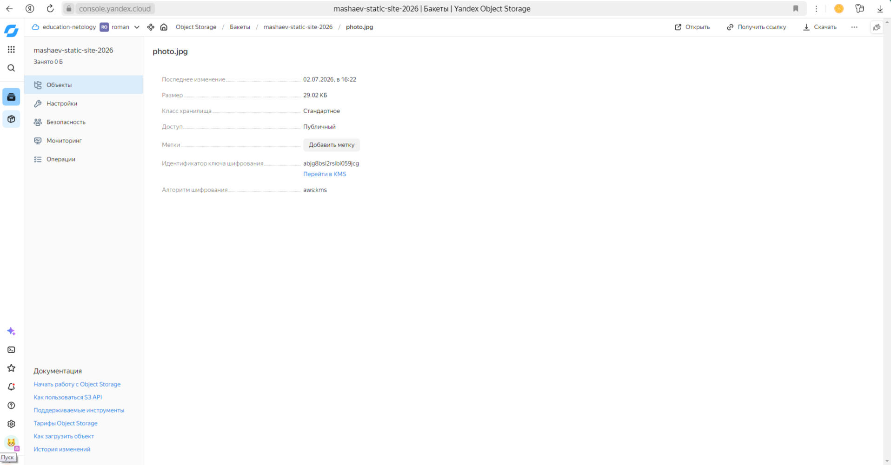

# Домашнее задание: Безопасность в облачных провайдерах (Yandex Cloud)

##  Вполнил - Машаев Роман

##  Задание

1. **Шифрование бакета**
   Создать ключ в KMS и зашифровать содержимое бакета (Terraform).

2. **Статический сайт с HTTPS**
   Создать статический сайт в Object Storage с собственным публичным адресом и сделать доступным по HTTPS (выполняется не в Terraform).

---

##  Часть 1: Шифрование бакета (Terraform)

### Выполнено
- Создан симметричный ключ в KMS через Terraform.
- Создан бакет `mashaev-static-site-2026` с включённым шифрованием через этот ключ.
- Загружен тестовый файл `photo.jpg` с шифрованием для демонстрации.

### Подтверждение
Скриншот свойств зашифрованного файла в бакете `mashaev-static-site-2026`:

На скриншоте видны:
- **Идентификатор ключа шифрования:** `abjg8bsl2rsibi059jcg`
- **Алгоритм шифрования:** `aws:kms`

Файлы Terraform (конфигурация инфраструктуры) находятся в папке `terraform/` этого репозитория.

---

##  Часть 2: Статический сайт с HTTPS (ручная настройка)

### Выполнено

1. **Создан и настроен бакет для хостинга**
   - Бакет `mashaev-static-site-2026` сделан публичным.
   - Включён режим «Хостинг» с главной страницей `index.html` и страницей ошибок `error.html`.
   - Файлы сайта загружены и доступны по временному адресу:
     `http://mashaev-static-site-2026.website.yandexcloud.net`

2. **Зарегистрирован собственный домен**
   - Домен `mashaev-test.ru` зарегистрирован у регистратора Reg.ru.

3. **Настроена DNS-зона в Yandex Cloud**
   - Создана публичная DNS-зона `mashaev-test.ru.` в сервисе Cloud DNS.
   - Добавлена ANAME-запись, указывающая на бакет:
     `mashaev-static-site-2026.website.yandexcloud.net.`  
   - Домен делегирован на NS-серверы Yandex Cloud:
     `ns1.yandexcloud.net`, `ns2.yandexcloud.net`.

4. **Получен и применён SSL-сертификат**
   - В сервисе Certificate Manager создан сертификат от Let's Encrypt для домена `mashaev-test.ru`.
   - Использована **DNS-проверка** (CNAME-запись `_acme-challenge`).
   - После успешной проверки сертификат выпущен (статус `Issued`).
   - Сертификат применён к бакету `mashaev-test.ru` через настройки HTTPS.

5. **Сайт доступен по HTTPS**  
   - Открывается по адресу: [https://mashaev-test.ru](https://mashaev-test.ru)
   - В адресной строке отображается **замочек 🔒**, подтверждающий защищённое соединение.

### Подтверждение
Скриншот работающего сайта с HTTPS:  

На скриншоте видно:
- Адрес `https://mashaev-test.ru`
- Замочек в адресной строке

---
